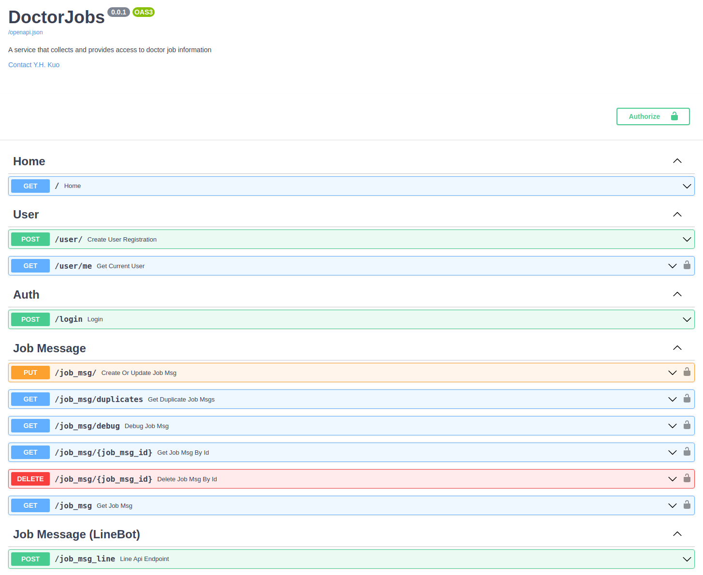

# Doctor Jobs
A chatbot that collects and helps users find doctor job information

## Build Instructions

### Linux, using Python 3.10 or higher and virtualenv

Install system packages

    sudo apt-get install python3 python3-pip python3-virtualenv

Install remaining packages in virtualenv

    virtualenv -p `which python3` venv
    ./venv/bin/pip3 install -r requirements.txt

Export package information

    pip install pipreqs
    pipreqs --force
    

### Run tests in command line
    
    pip install pytest pytest-cov
    python -m pytest

### Run tests in PyCharm

If you PyCharm project is the repository, then mark root directory as sources root (in Project panel, in the
context menu of directory "Mark Directory As" -> "Sources Root").

## Run FastAPI application and Expose Port

    hypercorn --keyfile key.pem --certfile cert.pem main:app --bind 0.0.0.0:8000

OR

    hypercorn main:app --bind 0.0.0.0:8000
    ngrok http 8000

## Docker
### Build Image

    DOCKER_BUILDKIT=1 docker build -t doctorjobs:latest .

### Run Docker Compose

    docker-compose up -d

### Push to Docker Hub

    docker tag doctorjobs:latest yhkuo41/doctorjobs:0.0.1
    docker login
    docker push yhkuo41/doctorjobs:0.0.1
    